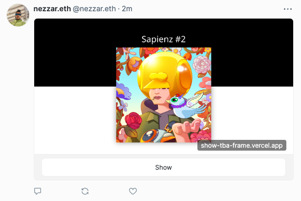
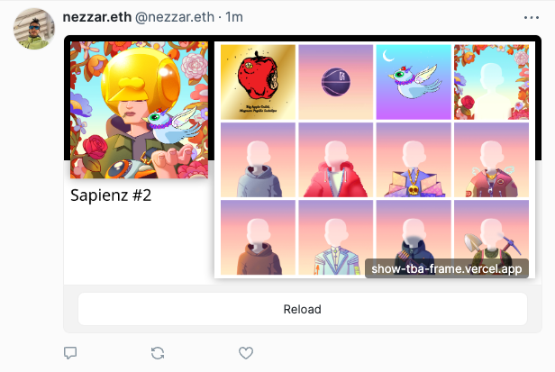

# 🖼️ TBA-FRAME

  
  

 

Simple Farcaster Frame that loads the content of any ERC6551 TBA

## Usage

Pass the following properties in the url's search parameters

|Property|Description|Required|Default|
|------|-------|-------|--------|
|tokenContract|contract address of ERC721's|true||
|tokenId|tokenId of ERC721|true||
|chainId|chainId of TBA |true (see supported networks)||
|version|version of TBA|false|3|

#### Supprted Network
|Network|ChainId|
|---|---|
|Mainnet|1|
|Polygon|137|
|Goerli|5|
|Base Mainnet|8453|

## Deployment

`main` is deployed @ [https://tbaframe.xyz](https://tbaframe.xyz), use if to share tba frames on warpcast

## Example

Sapienz #3

https://tbaframe.xyz?tokenContract=0x26727Ed4f5BA61d3772d1575Bca011Ae3aEF5d36&tokenId=420&chainId=1&version=2

## Learn more
- [Tokenbound](https://docs.tokenbound.org/)
- [ERC6551](https://eips.ethereum.org/EIPS/eip-6551)
